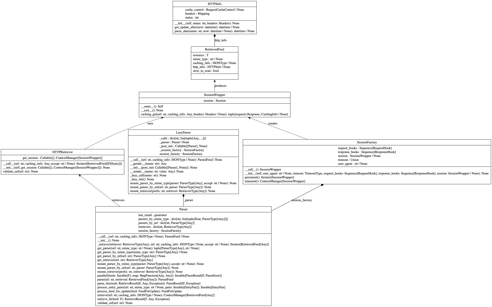
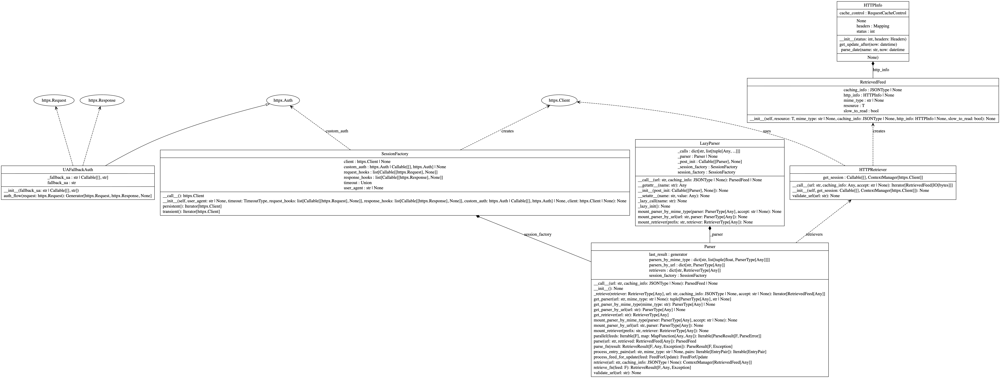

# Report for assignment 4

**Group 10**: William, Villiam, Erik, Alrik, Boyan

## Project

Name: reader

URL: https://github.com/lemon24/reader

`reader` is a Python library feed reader library for managing RSS, Atom, and JSON feeds. It is designed to allow writing feed reader applications without any business logic boilerplate and without depending on a particular framework.

## Onboarding experience

> Did you choose a new project or continue on the previous one? If you changed the project, how did your experience differ from before?

We choose to work on a new project instead of `mypy` that we worked on in assignment 3. Compared to `mypy`, `reader`
did feel less complex and considerably more approachable based on the time we had to complete the assignment.
The code is well structured, the issue we chose has a somewhat clear scope and a stable test suite.
Before choosing `reader`, we were working on `poke-env` (https://github.com/hsahovic/poke-env)
but ultimately chose not to because that project required too much domain specific knowledge about the pokemon universe.

## Effort spent

For each team member, how much time (**in hours**) was spent in:

| Tasks | Villiam | William | Erik | Alrik | Boyan |
|------|---------|---------|------|-------|-------|
| 1. Plenary discussions/meetings | 5 | 5 | 5 | 5 | 5 |
| 2. Discussions within parts of the group | 5 | 3 | E5| 3 | 5 |
| 3. Reading documentation | 1 | 1 | 4 | 2 | 1 |
| 4. Configuration and setup | 1 | 0.5 | 3 | 0.5 | 1 |
| 5. Analyzing code/output | 10 | 4 | 5 | 5| 8 |
| 6. Writing documentation | 2 | 3 | 5 | 2| 1 |
| 7. Writing code | 5 | 3 | 5 | 5 | 10 |
| 8. Running code | 3 | 2 | 2 | 3 | 2 |

For setting up tools and libraries (step 4), enumerate all dependencies
you took care of and where you spent your time, if that time exceeds
30 minutes.

## Overview of issue(s) and work done.

Title: `Use httpx instead of requests`

URL: https://github.com/lemon24/reader/issues/360

`reader` previously used **requests** for HTTP, but its lack of default timeouts and limited hook support had led to increasingly complex workarounds. This issue replaces it with **httpx**, a more modern alternative with built-in timeouts, cleaner request/response hooks, and future HTTP/2 support.

### Scope (functionality and code affected).

We found early that the requests library had already been abstracted into only two main classes. Our aim was to swap the implementation
across these two classed by relpacing every instance of requests for httpx. Thereby we hoped to achive full backwards compatability with
no changed interfaces or functionality affected.

Where the functionality had not been abstracted, was mainly in the test suite. The test suite consistently choose to mock out requests
from tests where the call was not emitted until 4-5 calls deep. This gave us a lot of trouble in debugging and fixing tests. Ultimately
it was not totally possible to replace every single mock in the test suite, and we instead provided a small compatability shim that allows
mocking out requests while actually mocking out the equivalent httpx call. This works but creates a large point of confusion in the tests
since it still looks like requests is being used.

## Requirements for the new feature or requirements affected by functionality being refactored
The following was our working requirements formulated from the original issue:

- [x] (1.0.0) Provide a POC implementation/replacement for current [HTTPRetriver](https://github.com/lemon24/reader/blob/54f89e04b71af86d1eba4f1a70931f895c09401f/src/reader/_parser/http.py#L24) using the [httpx](https://pypi.org/project/httpx/) library.
  - [x] (1.1.0) Implement `__call__` function. Sends a request to some *url* and returns a `RetriverFeed`.
    - [x] (1.1.1) Uses some equivalent of  [SessionWrapper](https://github.com/lemon24/reader/blob/3.14/src/reader/_parser/requests/_lazy.py#L45-L144)) to support caching requests.
  - [x] (1.2.0) Implement `validate_url` function. Uses some notion of [prepared requests](https://tedboy.github.io/requests/adv3.html) to validate outgoing requests. **(Further details/explaination needed)**
- [x] (2.0.0) Provide the same functionality provided by [SessionWrapper](https://github.com/lemon24/reader/blob/3.14/src/reader/_parser/requests/_lazy.py#L45-L144) either via new of native implementation.  **(Further details/explaination needed. May not be relevant)**
  - [x] (2.1.0) Refactor SessionFactory to use httpx.Client with native timeout and event_hooks.
  - [x] (2.2.0)Adapt ua_fallback plugin to use httpx response hook signature.
- [x] (3.0.0) Interface must be backwards compatible. We are swapping out the implementation details of [requests](https://pypi.org/project/requests/) everything must work the same from the outside.
- [x] (4.0.0) Wire implementation into the public interface **(HOW? tbd)**

## Code changes

### Patch

The patch of changes can be viewed in our working pr: https://github.com/DD2480-2025-Group10/reader-fork-assignment4/pull/4

It should be noted that in the patch all previous tests are passing but the project has a hard 100% coverage requirement. We have
digressed on this part down to 99% coverage as some new codepaths may not be covered by the old test suite.

## Test results

The test results can be seen under the test-logs folder on this main branch.

## UML class diagram and its description

The HTTP layer is built around the requests library and relies on a custom SessionWrapper to extend and control its behavior. SessionFactory creates SessionWrapper instances, which wraps a requests.Session and were responsible for handling timeouts, applying request and response hooks, managing caching headers through caching_get(), and implementing retry logic such as the UA fallback. The UA fallback itself was implemented as a response hook registered in SessionFactory. 

The main change between the two versions is the replacement of the requests-based HTTP layer with an httpx-based implementation, which simplifies the architecture and removes the custom SessionWrapper. In the old version, SessionWrapper wrapped requests.Session, handled caching, executed request and response hooks, and implemented retry logic such as the UA fallback through a response hook registered in SessionFactory. In the new version, httpx.Client is used directly, caching logic is handled inside HTTPRetriever, hooks are implemented using httpx event hooks, and the UA fallback mechanism is refactored into a UAFallbackAuth class that uses httpx’s Auth interface and its auth_flow retry mechanism. 

### Key changes/classes affected

Optional (point 1): Architectural overview.

Optional (point 2): relation to design pattern(s).

## Way of working (NOT DONE)

### Principles Established

Principles and constraints are committed to by the team. ✅

Principles and constraints are agreed to by the stakeholders. ✅

The tool needs of the work and its stakeholders are agreed.  ✅

A recommendation for the approach to be taken is available. ✅

The context within which the team will operate is understood ✅

The constraints that apply to the selection, acquisition, and use of practices and tools are
known. ✅

### Foundation Established

The key practices and tools that form the foundation of the way-of-working are
selected. ✅

Enough practices for work to start are agreed to by the team. ✅

All non-negotiable practices and tools have been identified. ✅

The gaps that exist between the practices and tools that are needed and the practices and
tools that are available have been analyzed and understood. ✅

The capability gaps that exist between what is needed to execute the desired way of
working and the capability levels of the team have been analyzed and understood. ✅

The selected practices and tools have been integrated to form a usable way-of-working. ✅

### In Use

The practices and tools are being used to do real work. ✅

The use of the practices and tools selected are regularly inspected. ✅

The practices and tools are being adapted to the team’s context. ✅

The use of the practices and tools is supported by the team. ✅

Procedures are in place to handle feedback on the team’s way of working. ✅

The practices and tools support team communication and collaboration. ✅

### In Place

The practices and tools are being used by the whole team to perform their work. ❌

All team members have access to the practices and tools required to do their work. ✅

The whole team is involved in the inspection and adaptation of the way-of-working. ✅

Based on the checklist in the Essence Standard v1.2, we assess our work as being in the In Place state, having hit 2 milestones in the in place phase. We had some issues with using the same tools in this lab, but in the end we managed to sort it out. Almost all practices and tools are being used by the whole team.

## Overall experience (NOT DONE)

What are your main take-aways from this project? What did you learn?

How did you grow as a team, using the Essence standard to evaluate yourself?
